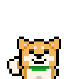

# リリアと魔女 [LILIEA]
魔女にさらわれたヒメをおって、リリアのぼうけんがはじまる！


スマートフォンや　PC ブラウザで遊ぶゲームです。
ゲームエンジン [Akashic Engine](https://akashic-games.github.io/) 製の [サンプルゲーム](https://github.com/akashic-contents/tilemap-survivors) 改造版です。

[ニコ生ゲーム](https://site.live.nicovideo.jp/ichiba.html)で遊ぶことができます。
生放送番組で放送者・視聴者といっしょに遊んでみましょう！

## ゲームを遊ぶ
リリアを動かし、襲いくる魔女の軍勢を避けてうまく生き残ってください。

### 起動方法 
以下のサービスで遊べます。

* [ゲームアツマール](https://game.nicovideo.jp/atsumaru/)
  * シングルゲームとして遊ぶことができます。
  * https://game.nicovideo.jp/atsumaru/games/gm28400
* [ニコニコ生放送アプリ](https://site.live.nicovideo.jp/app/guide.html)
* [ニコニコ生放送 PC サイト](https://site.live.nicovideo.jp/ichiba.html)
  * スコアを競うランキングゲームとして遊ぶことができます。
  * 放送者の方は番組で「放送ネタ > 自作ゲーム > リリアと魔女」で検索して起動してください。
  * 視聴者の方は起動中の番組で遊んだり、放送ネタをリクエストすることができます。

また、このリポジトリをビルドすることで実行することができます。

```
$ npm install # インストール・ビルド
$ npm start   # localhost:3000 で実行します。ブラウザで http://localhost:3000/game にアクセスしてください。
```

### 操作方法
画面をタップ・クリックするとリリアが移動します。


攻撃は自動で行います。リリアは骨を投げて攻撃することができます。


敵を倒すとアイテムを落とします。このアイテムはリリアとその仲間を強化します。


アイテムを取りつづけると、リリアの攻撃がレベルアップします。


空から星が落ちてくることがあります。ともだちが助けに来てくれたのかもしれません。


### 登場人物
#### リリア


のんびりや。やるときはやる！

#### ヒメ


うっかりや。リリアとさんぽをしていたらさらわれた。

#### 魔女


わがまま。ヒメをさらいリリアに土人形をけしかけてくる。

#### リリアのなかま

あつくもえる　モエル。
ほのおのたまをたべるとブレスをはく！


さむがりやの　サムサム。
こおりのたまをたべるとスノーバリアをはる！


びりびりしびれる　ビリー。
かみなりのたまをたべると稲妻が落ちる！


そんざいがふあんていな　スペーシア。
うちゅうのたまをたべると空間に裂け目が...

## ゲームを作る
本リポジトリをベースにオリジナルゲームに改造してみましょう。

今後、Wiki などで解説記事を掲載する予定です。


## 利用素材
詳細は [素材ファイル一覧](./docs/material.csv) をご覧ください。

以下のサイトの素材を利用しています。ありがとうございます。
|サイト| バージョン| ライセンス| 用途|
|:----|:----|:----|:----|
|[Akashic Engine サンプルデモの素材](https://akashic-games.github.io/asset/material.html)| 2022-11-30 | CC BY 2.1 JP| エフェクト・タイルマップ　|
|[shinonomekazan/akashic-assets](https://github.com/shinonomekazan/akashic-assets)| 2022-11-30 | CC BY 2.1 JP| キャラクター画像　|
|[泥棒バスター](https://github.com/akashic-contents/thiefBuster) | 2022-11-30 | CC BY 2.1 JP | スコア画像・SE |
|[Ricty Diminished](https://rictyfonts.github.io/diminished) | 4.1.1 | SIL Open Font License (OFL) Version 1.1 | ラベル用フォント |

## 利用ツール
以下のツールを利用し素材を作成・加工しています。ありがとうございます。
|サイト| バージョン| ライセンス| 用途|
|:----|:----|:----|:----|
|[GIMP](https://www.gimp.org/)| 2.10.32| GPLv3| 背景・パターン・テクスチャ・エフェクトなどの作成・調整|
|[Tiled](https://www.mapeditor.org/)| 1.9.2| GPLv2 BSD Apache| ステージのタイルマップ作成|
|[Effekseer](https://effekseer.github.io/)| 1.70a | 公式サンプル: CC0| エフェクト作成|

## ライセンス
本リポジトリは MIT License の元で公開されています。
詳しくは [LICENSE](./LICENSE) をご覧ください。

本リポジトリの画像ファイル、音声ファイルの詳細は [素材ファイル一覧](./docs/material.csv) をご覧ください。
